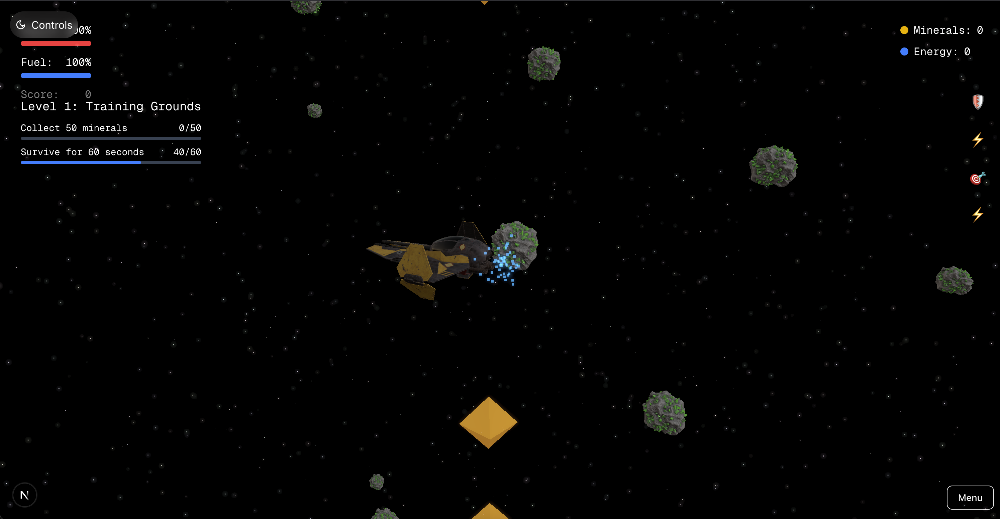
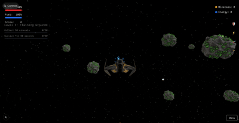

# Cosmic Explorer 🚀

A thrilling 3D space exploration game built with React Three Fiber and TypeScript. Navigate through asteroid fields, collect valuable minerals, and complete missions across multiple levels.



## 🌟 Features

- **3D Space Environment**: Immersive space environment with dynamic lighting and particle effects
- **Realistic Physics**: Accurate space physics using React Three Cannon
- **Multiple Levels**: Progress through increasingly challenging levels
- **Resource Collection**: Gather minerals to unlock new levels
- **Power-ups**: Collect and use various power-ups to enhance your spacecraft
- **Mission System**: Complete different types of missions in each level
- **Responsive Controls**: Smooth and intuitive spacecraft controls
- **Visual Effects**: Beautiful particle effects, explosions, and lighting
- **Sound Effects**: Immersive audio feedback for actions and events

## 🎮 Controls

- **Movement**: WASD or Arrow keys
- **Boost**: Spacebar
- **Camera**: Right-click and drag to rotate view
- **Menu**: ESC

## 🛠️ Tech Stack

- React Three Fiber
- Three.js
- React Three Cannon
- TypeScript
- Zustand (State Management)
- Tailwind CSS

## 🚀 Getting Started

1. Clone the repository:
```bash
git clone https://github.com/yourusername/cosmic-explorer.git
```

2. Install dependencies:
```bash
npm install
# or
yarn install
```

3. Start the development server:
```bash
npm run dev
# or
yarn dev
```

4. Open [http://localhost:3000](http://localhost:3000) in your browser

## 🎯 Gameplay

### Objectives
- Navigate through asteroid fields
- Collect minerals to progress
- Complete level-specific missions
- Manage your spacecraft's health and fuel
- Use power-ups strategically

### Level Progression
- Each level requires collecting a specific amount of minerals
- Difficulty increases with each level
- New challenges and obstacles appear in higher levels

## 📸 GamePlay



## 🤝 Contributing

Contributions are welcome! Please feel free to submit a Pull Request.

## 📝 License

This project is licensed under the MIT License - see the [LICENSE](LICENSE) file for details.

## 🙏 Acknowledgments

- 3D models and textures from various sources
- Sound effects from [source]
- Special thanks to the React Three Fiber community

## 📧 Contact

Your Name - [@yourtwitter](https://twitter.com/yourtwitter) - email@example.com

Project Link: [https://github.com/yourusername/cosmic-explorer](https://github.com/yourusername/cosmic-explorer)
